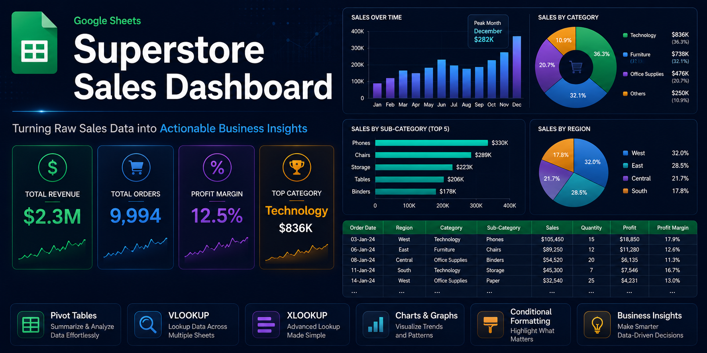

# google-sheets-sales-dashboard
Sales dashboard built using Google Sheets to analyze 9,994 Superstore orders worth $2.3M — uncovering key business insights through Pivot Tables, VLOOKUP, XLOOKUP, and Data Visualization

# 📊 Superstore Sales Dashboard

## 🔍 Overview
Analyzed the famous Superstore Sales dataset using Google Sheets to build a comprehensive sales dashboard. Transformed 9,994 orders worth $2.3M in revenue into clear, actionable business insights through advanced spreadsheet techniques.

---

## 📈 Key Findings & Insights

### 1. 🏆 Revenue Performance
- **Total Revenue:** $2.3M across 9,994 orders
- **Overall Profit Margin:** 12.5%

### 2. 📦 Category Analysis
- **Technology** dominates with **$836K** (36.3% of total revenue)
- **Furniture** follows with **$738K** (32.1%)
- **Office Supplies** at **$476K** (20.7%)

### 3. 📅 Sales Trends
- **November-December** peak season — holiday demand drives highest sales
- Clear seasonal pattern identified for inventory planning

### 4. 🌍 Regional Performance
- **West** leads with **32%** of total sales
- **South** lowest at **17.8%** — opportunity for growth

---

## 🎯 Key Takeaways
- Technology drives **36.3% of total revenue** — highest performing category
- Holiday season **(Nov-Dec)** requires aggressive inventory stocking
- West region is the **strongest market**
- South region needs **urgent sales strategy improvement**
- Furniture category has **low profit margin** — pricing review recommended

---

## 🛠️ Skills Demonstrated
- ✅ Pivot Tables — Data summarization and analysis
- ✅ VLOOKUP & XLOOKUP — Advanced data lookup across sheets
- ✅ Charts & Graphs — Visual trend analysis
- ✅ Conditional Formatting — Highlighting key metrics
- ✅ Business Insight Generation
- ✅ Data-Driven Recommendations

---

## 📂 Dataset
- **Source:** Superstore Sales Dataset
- **Orders:** 9,994
- **Revenue:** $2.3M
- **Categories:** Technology, Furniture, Office Supplies
- **Regions:** West, East, Central, South
